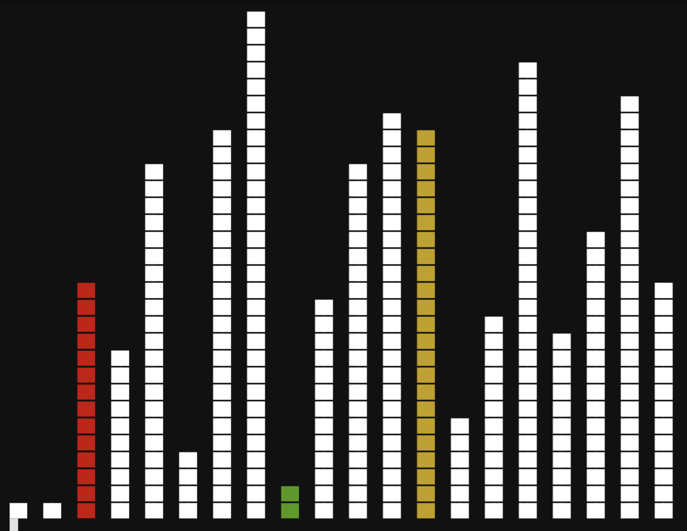

# printSort
## Was tut es?
Es zeigt visuell die Funktion eines Sortieralgorithmuses in der Konsole. Die Zahlen werden zufällig genertiert.

- **Rot**: Erste Schleife; Wird verglichen mit:
- **Gelb**: Zweite Schleife
- **Grün**: Makiert die aktuell kleinste Zahl in der zweiten Schleife

## Use
> :warning: **nur für Linux/macOS Terminals**
```
python3 printSort.py <länge> <maximal> <sleep>
```
- `<länge>`: `int` Wie viele Zahlen sollen sortiert/generiert werden?
- `<maximal>`: `int` Wie groß soll die größte Zahl sein?
- (optional) `<sleep>`: `float` wie lange soll eine Änderung angezeigt werden? (default: `0.2`)

# Vorschläge und Anregungen
Ich bin Neuling was Programmierung angeht. Daher, wenn du Vorschläge oder Verbesserungen hast, kannst du mir über [:busts_in_silhouette: Discussions](https://github.com/professorchen73/printSort/discussions ":busts_in_silhouette: Discussions") davon erzählen.


 
